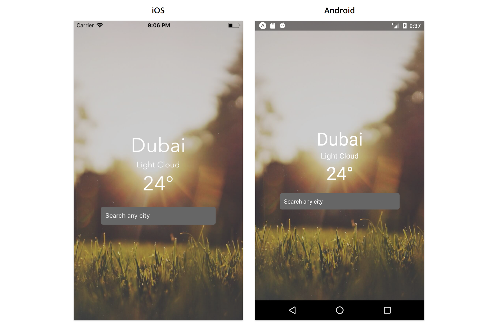

# React Native Weather App

Simple weather app I built while learning React Native from Fullstack React book by [Newline](https://www.newline.co).
Users enter a city and it returns the weather for that city while including some visual changes to reflect the current weather in the city.

## Notes

Built with: [Expo](https://expo.dev/)

I made two significant changes to the app from the book:

1. I built the entire app using Typescript rather than Javascript
2. The book used class components whereas I opted to use function components and React Hooks

## Screenshots

